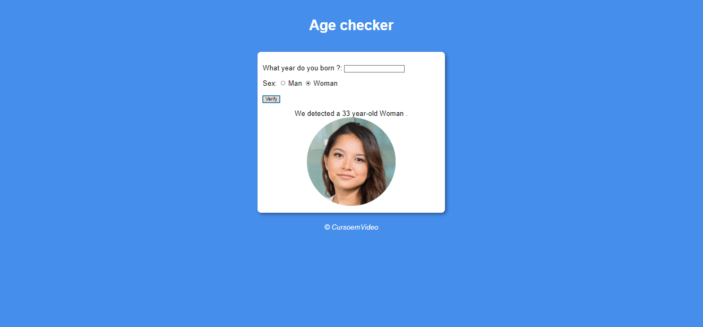

<h1 align="center">What time is it</h1>

Exclusive and free program, promoted by Google for teaching WEB technologies.

  <a href="#-tecnologias">Technology</a>&nbsp;&nbsp;&nbsp;|&nbsp;&nbsp;&nbsp;
  <a href="#-projeto">Project</a>&nbsp;&nbsp;&nbsp;|&nbsp;&nbsp;&nbsp;
  <a href="#memo-licença">License</a>

  

 

  

## 🚀 Technology

This project was developed with the following technologies:

- HTML e CSS
- JavaScript
- Git e Github

## 💻 Project

What time is, is a page where you can see the time on your computer, and according to each time, the photo and background color change

## :memo: License

This project is under the MIT license.

---

Feito com ♥ by eusancler